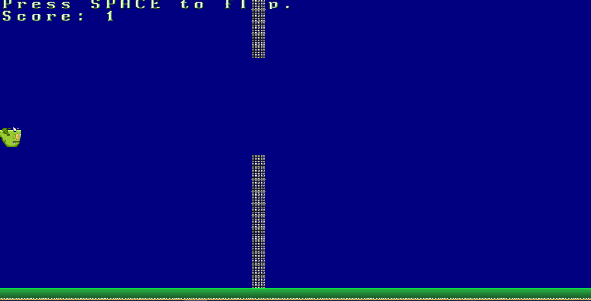

# Crappy Bird / Flappy Dragon
A simple 2D game project that I made following the book "Hands-on Rust".

### To run it locally you can:
Make sure you have Rust installed locally.

1. Clone this repository 
2. Execute "cargo run" on your terminal, inside the root folder.

